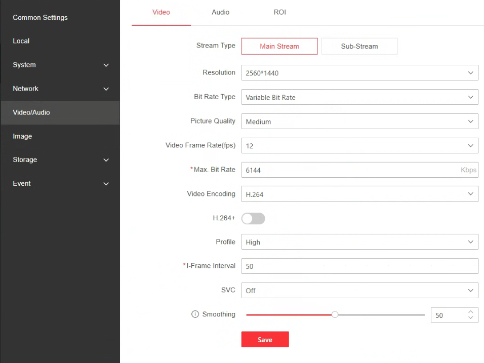
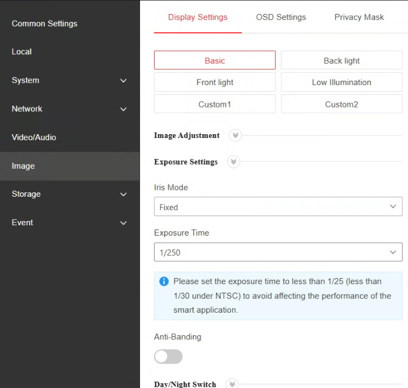
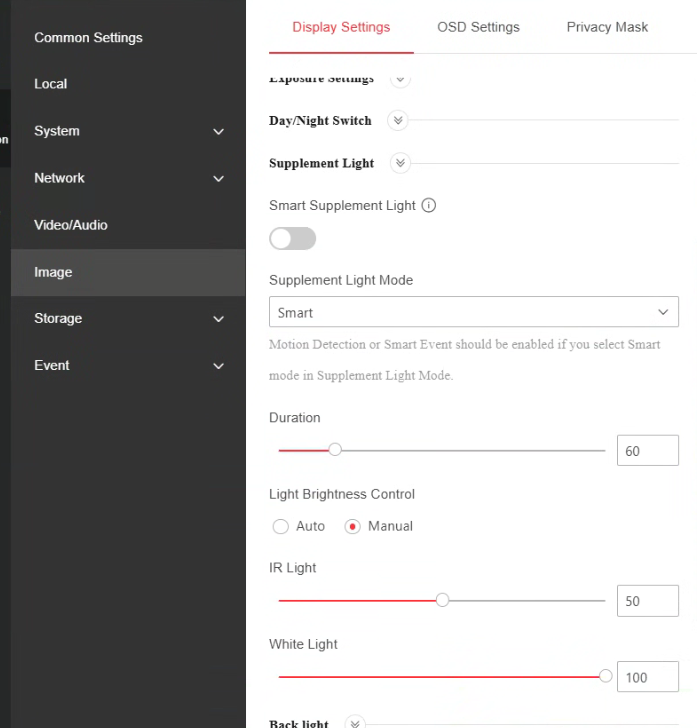
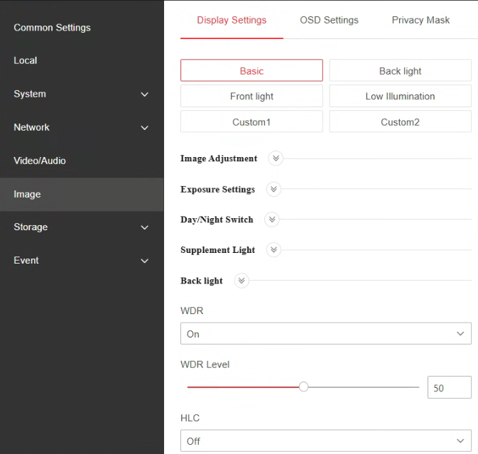
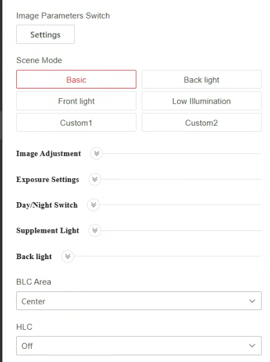
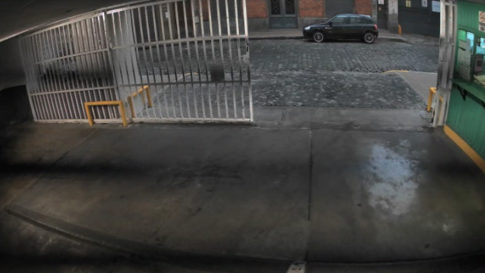
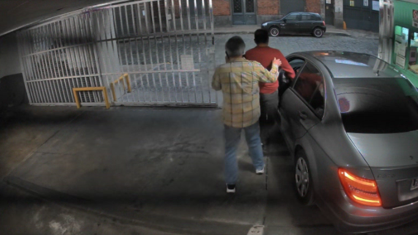

# Guía: dejar la cámara y la app funcionando mejor

Esta guía es para el dueño del estacionamiento. No hace falta saber de
computación: son opciones que se cambian haciendo clic, y todas se pueden
deshacer.

**Tiempo estimado:** 20 minutos la cámara, 5 minutos la app.

**Qué vas a conseguir:**

- Que la computadora deje de trabajar al pedo (hoy el programa de la cámara usa
  casi un tercio de la máquina todo el día, y la PC tiene sólo dos núcleos).
- Que lea bien las patentes al atardecer, que es cuando hoy falla más.
- Que dejen de aparecer tantas tarjetas para descartar a mano.

---

## ⚠️ Antes de empezar: anotá lo que hay

Antes de tocar cada opción, **sacale una foto con el celular a la pantalla**.
Si algo queda peor, con esa foto volvés a como estaba en un minuto.

---

# PARTE 1 — La cámara

Es la parte que más cambia las cosas. De acá sale la mayor parte de la mejora.

## Cómo entrar a la cámara

1. Abrí el navegador (Chrome, Edge, el que uses) en la computadora del
   estacionamiento.
2. En la barra de direcciones escribí la **dirección IP de la cámara** y apretá
   Enter. Es la misma que está cargada en Parkit: la ves en
   **Configuración → Cámara**, en el campo de la dirección.
3. Te va a pedir usuario y contraseña: son los mismos que cargaste en Parkit.
4. Si el navegador avisa que "la conexión no es privada", es normal en estas
   cámaras: entrá igual (Avanzado → Continuar).

> **Si no te deja entrar:** la cámara sólo acepta 6 usuarios a la vez. Cerrá la
> app del celular si la tenés abierta mirando la cámara, y probá de nuevo.

---

## 1.1 — Bajar los cuadros por segundo (de 20 a 12)

**Por qué:** la cámara manda 20 fotos por segundo y Parkit usa 10. Las otras 10
se procesan y se tiran. Es más de un tercio del trabajo de la computadora,
gastado en nada.

**No se pierde ninguna detección**: Parkit nunca miró esas fotos de más.

**Pasos:**

1. En el menú de la cámara entrá a **Configuración**.
2. Buscá **Vídeo/Audio** (puede decir "Video/Audio" o "Video Settings").
3. Arriba vas a ver un selector que dice **Tipo de secuencia** o **Stream Type**.
   Asegurate de que diga **Secuencia principal** (Main Stream).
4. Buscá el campo **Velocidad de fotogramas** (o "Frame Rate").
5. Cambialo de **20** a **12**.
6. Clic en **Guardar**.

Así tiene que quedar esa pantalla, con los dos cambios (1.1 y 1.2) ya hechos:

Lo que importa de esa pantalla es **Video Frame Rate: 12**. El resto se deja
como está.

_(En la captura el códec quedó en H.264, que fue el primer intento. Terminó en
H.265+ después de medir — ver el paso siguiente.)_

> **Importante:** si hacés este paso, **tenés que hacer también el 1.3**
> (el obturador). Si no, las fotos de noche van a salir más movidas que ahora.
> Los dos van juntos.

---

## 1.2 — El códec: probar los dos y quedarse con el que mida menos

> ⚠️ **Este paso NO tiene una respuesta única. Hay que medirlo.**
>
> En la primera versión de esta guía decía "cambiá a H.264" y **resultó
> equivocado para esta PC**. Lo dejo documentado porque el razonamiento parecía
> sólido y no lo era.
>
> Medido en la playa, con todo lo demás igual:
>
> | Códec      | CPU       | Red          |
> | ---------- | --------- | ------------ |
> | H.264      | 32,9%     | 6,1 Mbps     |
> | **H.265+** | **28,0%** | **1,7 Mbps** |
>
> Gana H.265+ por un 15%.

**Por qué no hay una respuesta fija:** hay dos fuerzas que tiran para lados
opuestos.

- **H.265 es más caro de descomprimir** por cada cuadro. Eso favorece a H.264.
- **H.265+ comprime mucho mejor** — salta lo que no cambia en la escena, y en
  una entrada de garaje casi nada cambia. Eso significa muchos menos datos que
  procesar, y favorece a H.265+.

Cuál gana depende de si la placa de video puede descomprimir por hardware. **Si
puede**, H.264 gana cómodo porque la GPU hace el trabajo pesado. **Si no**, el
ahorro de datos de H.265+ es lo que manda.

En esta PC —un Pentium G4400 con una GT 730 y la gráfica integrada aparentemente
deshabilitada— no hay aceleración, y por eso gana H.265+.

**Pasos — es un experimento de cinco minutos:**

1. En la misma pantalla de **Vídeo/Audio**, buscá **Tipo de codificación de
   vídeo** (o "Video Encoding").
2. Dejalo en **H.265+** (o ponelo, si no está).
3. Guardá, **reiniciá el servicio de cámara** desde Parkit y medí el CPU 30
   segundos con la app en **Operativo**. Anotá el número.
4. Ahora cambialo a **H.264** (sin el "+"), guardá, reiniciá y medí igual.
5. **Quedate con el que dio menos.**

> **Reiniciar el servicio no es opcional.** Parkit mantiene la conexión con la
> cámara abierta, y los parámetros del video se acuerdan al conectar. Si no
> reiniciás, seguís midiendo el códec viejo.

> **Y medí siempre desde Operativo, nunca desde la pantalla de Cámara.** Con el
> video en vivo abierto el servicio trabaja bastante más para mostrártelo, y
> ese costo no existe el resto del día. En esta instalación la diferencia entre
> una pantalla y la otra fue de 8 puntos de CPU — suficiente para sacar una
> conclusión equivocada.

---

## 1.3 — El obturador: esto es lo que arregla las fotos movidas ⭐

**Este es el cambio más importante de toda la guía.**

**Por qué:** cuando baja la luz, la cámara deja el "ojo" abierto más tiempo para
que entre más luz. El problema es que si el auto se está moviendo, la patente
sale **barrida**, como cuando sacás una foto con pulso tembloroso. Por eso al
atardecer las lecturas se derrumban.

Los números lo confirman: a las 4 de la tarde la cámara lee bien 9 de cada 10
veces; a las 7 de la tarde falla 6 de cada 10.

**La solución** es ponerle un límite: "nunca dejes el ojo abierto más de este
tiempo, aunque esté oscuro".

> **¿Por qué 1/100 y no 1/250, que sería más rápido todavía?**
>
> Por la luz eléctrica. En Argentina la red es de 50 Hz, así que las lámparas
> **parpadean 100 veces por segundo**. El ojo no lo ve; la cámara sí.
>
> Un obturador de 1/100 dura **exactamente un parpadeo completo**, así que
> todas las fotos reciben la misma cantidad de luz. Con 1/250 cada foto cae en
> un momento distinto del ciclo y aparecen **franjas negras que bajan por la
> pantalla**.
>
> 1/100 sigue siendo dos veces y media más rápido que el límite de 1/25 que
> pide la cámara, así que la patente se congela igual de bien.
>
> Si tu playa se ilumina sólo con luz natural, 1/250 también sirve y congela un
> poco más. Pero si hay lámparas prendidas —que es justo cuando más falla la
> lectura— **1/100 es el valor correcto**.

**Pasos:**

1. En el menú de la cámara, entrá a **Configuración → Imagen** (o "Image").
2. Buscá la solapa **Ajuste de exposición** (o "Exposure Settings").
3. Vas a ver un campo que dice **Tiempo de exposición**, **Obturador** o
   **Shutter**. Probablemente diga **Auto**.
4. Cambialo a **1/100**.
5. Clic en **Guardar**.

_(En la captura se ve 1/250, que fue el primer intento. Terminó en 1/100 por el
parpadeo de las luces — ver abajo.)_

### Si te aparece este cartel, está todo bien

> ℹ️ _"Please set the exposure time to less than 1/25 (less than 1/30 under
> NTSC) to avoid affecting the performance of the smart application."_

**Ese mensaje te está dando la razón, no corrigiéndote.** Está mal redactado y
confunde a cualquiera, así que vale la pena entenderlo una vez:

Dice que el tiempo de exposición tiene que ser **menor a 1/25 de segundo**, o
sea que el ojo de la cámara tiene que quedar abierto **menos** tiempo que eso.

Lo confuso es que **1/100 es menos tiempo que 1/25**, aunque 100 sea un número
más grande que 25. Es como con una pizza: **1/100 de pizza es menos pizza que
1/25**. Cuanto más grande el número de abajo, más chico el pedazo — y acá el
"pedazo" es el tiempo que la cámara deja entrar luz.

Entonces: 1/100 cumple de sobra con lo que pide el cartel. Podés guardar
tranquilo.

De hecho el cartel confirma por qué hacemos esto: la cámara avisa que con el
ojo abierto más de 1/25 sus propias funciones inteligentes dejan de andar
bien. A Parkit le pasa exactamente lo mismo y por el mismo motivo — con el
auto en movimiento, la patente sale barrida.

> **Si 1/100 no está en la lista**, elegí otro con el número de abajo **más
> grande** que 25: 1/125, 1/200, 1/250, 1/500. Todos cumplen con el cartel.
> Lo que NO sirve es 1/25, 1/12 o 1/8.
>
> Ahora, si hay luz eléctrica prendida en la entrada, el único que además evita
> las franjas es **1/100** (o 1/50). Ver la sección de acá abajo.

### Si aparecen franjas negras que bajan por la pantalla

Es el efecto secundario esperable de este paso, y se arregla en treinta
segundos.

**Por qué pasa:** la luz eléctrica no es continua, **parpadea 100 veces por
segundo** (son los 50 Hz de la red argentina). El ojo no lo ve porque es muy
rápido. Pero ahora la cámara saca cada foto en 1/250 de segundo, que es **más
rápido que el parpadeo**: cada foto agarra la luz en un momento distinto del
ciclo, y eso se ve como bandas oscuras que se desplazan.

Con el obturador en Auto no pasaba porque las fotos eran mucho más lentas y
promediaban varios parpadeos.

**Cómo confirmarlo en diez segundos:** apagá las luces del lugar. Si las
franjas desaparecen, es esto. (Si siguen con las luces apagadas, no es
parpadeo y hay que mirar otra cosa.)

**Cómo se arregla:**

**Poné el Exposure Time en 1/100.** Listo, eso es todo. Un parpadeo completo
dura exactamente 1/100 de segundo, así que con ese obturador todas las fotos
reciben la misma luz.

> ⚠️ **El interruptor "Anti-Banding" NO sirve acá, aunque parezca que sí.**
>
> Está justo debajo del tiempo de exposición y se llama exactamente como el
> problema, así que es la trampa obvia. Pero **sólo funciona con el obturador
> en Auto**: lo que hace es dejar que la cámara elija un tiempo que esquive el
> parpadeo. Si vos fijaste el obturador a mano, la cámara ya no puede elegir
> nada y el interruptor queda prendido pero sin efecto.
>
> Por eso tampoco pregunta la frecuencia cuando lo prendés con un obturador
> fijo. Podés dejarlo prendido, no molesta.

> **Hay DOS fuentes de franjas, y hay que apagar las dos**
>
> Esto se descubrió probando, y es la parte menos obvia de toda la guía:
>
> | Obturador | WDR | Resultado         |
> | --------- | --- | ----------------- |
> | 1/250     | On  | franjas           |
> | 1/100     | On  | **franjas igual** |
> | 1/100     | Off | **limpio** ✓      |
>
> **Fuente 1 — el obturador.** Con 1/250 cada línea del sensor agarra el
> parpadeo en un momento distinto. Lo arregla pasar a 1/100.
>
> **Fuente 2 — WDR.** Saca dos fotos y las combina: una larga y una muy corta.
> Vos fijás la larga en 1/100, pero **la corta la elige la cámara** y es del
> orden de 1/1000 — cae en cualquier punto del parpadeo y mete las bandas en la
> foto combinada. Por eso 1/100 con WDR prendido sigue fallando.
>
> **No alcanza con apagar una sola.** Dejar 1/250 y apagar WDR tampoco sirve:
> volvés a la fuente 1.
>
> **Y por qué las franjas no son sólo estética: engañan al detector de
> movimiento.**
> Parkit decide "hay un auto" comparando cada cuadro con el anterior. Unas
> bandas que se desplazan cambian el brillo de medio cuadro entre una foto y la
> siguiente — muchísimo más que el umbral de sensibilidad. El sistema creería
> que entra un auto cada pocos segundos **toda la noche con la entrada vacía**,
> y cada falso disparo manda una imagen al reconocedor de patentes, que es el
> proceso más caro de todos.
>
> Y lo que ganarías con 1/250 es poco: un auto entrando a un garaje va a unos 5
> km/h y en 1/100 de segundo recorre poco más de un centímetro, sobre una
> patente de 40. El problema de las 19h nunca fue la diferencia entre 1/100 y
> 1/250 — era que el obturador automático se caía a 1/25 o más lento.
>
> **Conclusión: 1/100 + WDR en Off.** Esa es la combinación.

**Si con 1/100 todavía quedan franjas**, probá en este orden:

1. **1/50** — más lento, pero también cae justo en el ciclo. Perdés algo de
   congelamiento; seguís muy por encima de 1/25.
2. Apagá **WDR** (paso 1.5): al combinar dos fotos tomadas en momentos
   distintos, puede generar bandas por su cuenta.
3. Si nada de eso alcanza, el problema son las lámparas. Los LED baratos
   parpadean a frecuencias que no tienen nada que ver con la red, y ahí no hay
   obturador que lo arregle. Cambiar los tubos de la entrada por unos sin
   parpadeo es la única solución real — y es la menos urgente de todas.

> **¿Molestan de verdad?** Sí, aunque poco. Si una banda oscura justo cae sobre
> la patente en el momento de la foto, esa lectura sale peor. No es grave, pero
> es gratis arreglarlo y no hay razón para convivir con eso.
>
> Lo que **no** hay que hacer es volver el obturador a Auto: cambiarías un
> problema chico por el grande que acabás de arreglar.

**Ahora mirá el video en vivo:**

- Si se ve **bien**, listo.
- Si de noche se ve **muy oscuro**, buscá en la misma pantalla **Ganancia**
  (Gain) y subila de a poco hasta que se vea. Puede quedar con un poco de
  "ruido" (granulado): eso no molesta a la lectura de patentes, el movimiento sí.
- Si aun así queda muy oscuro, probá con **1/125** en vez de 1/250. Sigue siendo
  mucho mejor que Auto.

---

## 1.4 — El infrarrojo de noche

**Por qué:** las patentes son reflectantes, como los carteles de la ruta. De
noche la cámara prende luces infrarrojas y la patente devuelve toda esa luz de
golpe: en la foto sale un **rectángulo blanco** sin letras.

**Pasos:**

1. **Configuración → Imagen**, solapa **Luz complementaria** o **Infrarrojo**
   (puede decir "Supplement Light" o "IR Light").
2. Si el modo está en **Auto**, cambialo a **Manual**.
3. Bajá la **Intensidad** (Brightness/Strength) a la mitad, más o menos **50**.

En esta instalación quedó **IR Light en 50** y **White Light en 100**. Si de
noche las patentes salen como un rectángulo blanco, lo primero que hay que
bajar es el **White Light**, que es el que más las quema. 4. Guardá y mirá un auto entrando de noche. 5. Si la patente **todavía sale blanca**, seguí bajando de a 10.
Si la patente **se lee pero el resto está muy oscuro**, no importa: lo que
nos interesa es la patente.

---

## 1.5 — Para el bache del mediodía

**Por qué:** alrededor de las 13-14h las lecturas también empeoran. Con el sol
alto suele ser contraluz: el fondo queda blanco y el auto, negro.

**Dónde está:** en **Configuración → Imagen**, pero **no** en la sección de
exposición ni en la de día/noche. Está en una sección aparte llamada
**Back light** o **Configuración de contraluz**. Las secciones están
**plegadas**: hay que bajar y abrirla.

> ⚠️ **Lo más probable es que WDR ya esté prendido.**
>
> En esta instalación estaba en **On, nivel 50** desde siempre. Así que este
> paso **no es activarlo**: es decidir si conviene dejarlo.
>
> Y hay un dato fuerte: todas las lecturas malas que medimos —las de las 19h y
> las del mediodía— pasaron **con WDR en 50**. Ya sabemos que así no está
> resolviendo nada.

**No vas a ver BLC ni HLC mientras WDR esté en On**: la cámara deja usar uno o
el otro, no los dos. Aparecen recién al apagar WDR.

**El experimento, en este orden:**

1. Abrí **Back light**.
2. Poné **WDR** en **Off**. Ahí aparecen **BLC** y **HLC**.
3. En **BLC Area** elegí **Center**.

   Las opciones son Off / Up / Down / Left / Right / Center, y lo que elegís es
   **dónde quiere la cámara medir la luz, ignorando el resto**. En esta entrada
   lo que descompensa la medición es la calle, que está **arriba** y es
   brillante; el auto queda a media altura, en el centro. Por eso va Center.

   **Down no**, aunque suene lógico: abajo es casi todo piso de cemento vacío,
   y si la cámara expone para el piso puede sobreexponer el auto.

   Si en tu instalación la cámara está puesta distinto, la regla es: elegí la
   zona **donde aparece la patente**, no la zona más oscura.

   Así queda:

   

   Fijate que **WDR ya no aparece en la lista**: al prender BLC, la cámara lo
   saca de la pantalla. Es la confirmación de que son excluyentes — usa uno o
   el otro, nunca los dos.

4. Guardá y mirá el video en vivo **con un auto entrando**.
5. **Si no ves una diferencia clara en la patente, volvelo a Off.**

> **No lo dejes prendido "por las dudas".** Este es el ajuste con menos
> evidencia de toda la guía: el bache del mediodía sale de unas 28 lecturas
> entre las 13 y las 14h, que es un puñado — puede ser contraluz real o puede
> ser casualidad. Si no se nota la mejora, es una variable de más sin beneficio.
>
> Y conviene hacerlo **después** de haber medido los cuatro cambios anteriores,
> no al mismo tiempo: si cambiás todo junto no vas a saber qué sirvió.

> ⚠️ **Por qué BLC antes que WDR, y por qué importa más de lo que parece**
>
> WDR saca dos fotos con exposiciones distintas y las combina. Con cosas
> quietas queda espectacular, pero **con un auto en movimiento las dos fotos no
> coinciden** y la patente puede salir con un fantasma o doble contorno — justo
> el problema que acabás de arreglar con el obturador en el paso 1.3.
>
> BLC no hace eso: es una sola foto, sólo corrige la medición de la luz. Por
> eso para leer patentes de autos en movimiento se prefiere BLC o HLC antes que
> WDR.
>
> Si prendés WDR y las patentes empeoran al mediodía, **apagalo**. Ese bache de
> las 13-14h sale de pocas lecturas y es el problema más chico de todos: nunca
> lo cambies por el de las 19h, que es el grande.

> 🚨 **NO toques "Scene Mode" (Modo de escena).**
>
> Arriba de esa pantalla hay botones: Basic, Back light, Front light, Low
> Illumination, Custom1, Custom2. **No son filtros: son paquetes completos de
> configuración.** Tocar cualquiera vuelve a cargar de golpe todos los valores
> de imagen de ese preset, y eso incluye el obturador.
>
> O sea que un click ahí puede **borrarte el 1/250 del paso 1.3** —el cambio
> más importante de toda la guía— sin avisarte.
>
> Si lo tocás por accidente: volvé al paso 1.3 y verificá que el tiempo de
> exposición siga en 1/250 antes de seguir.

> **Apagar WDR dejó de ser opcional**: es parte del arreglo de las franjas
> (ver el paso 1.3). Lo que sigue siendo opcional es prender BLC después.
>
> BLC es de una sola foto, así que no debería traer franjas de vuelta — pero
> miralo igual después de prenderlo.

---

# PARTE 2 — La app

## 2.1 — Actualizar Parkit

1. Cerrá Parkit si está abierto.
2. Instalá la versión nueva como siempre.
3. Abrila. Los ajustes que tenías cargados se mantienen.

## 2.2 — Qué cambió solo, sin que hagas nada

La app nueva ya viene con estas mejoras aplicadas:

- **El video de vista previa se envía más chico.** La imagen que ves en la
  pantalla de Cámara se achica antes de mandarse. Se ve prácticamente igual y
  la computadora trabaja siete veces menos. **No afecta** ni a la detección ni
  a las fotos que se guardan: esas siguen saliendo del video original.
- **Busca el movimiento en una versión reducida.** Para preguntarse "¿se movió
  algo?" ya no analiza la imagen completa. Decide exactamente lo mismo y cuesta
  16 veces menos.
- **Reparte mejor el trabajo entre los dos núcleos** de la computadora.
- **Un par de arreglos de fondo**: antes, si el lector de patentes se
  demoraba, la app creía que la cámara se había caído y la reconectaba sola —
  por eso aparecía "Cámara sin señal · reintento 46" sin que la cámara tuviera
  nada. Eso ya no pasa.

## 2.3 — Ajustes nuevos que vas a ver

En **Configuración → Cámara → Ajustes** aparecen dos campos nuevos y uno cambió
de valor:

### "Descartar por debajo de" — nuevo, viene en 0,60

Hasta ahora, **toda** lectura que hacía el sistema te llegaba como tarjeta,
aunque la hubiera leído con un 17% de seguridad. Por eso se te juntaban tantas
para descartar.

Mirando lo que pasó en tu estacionamiento: de las lecturas por debajo de 0,60,
**vos descartaste 147 de 158**. Eran ruido casi siempre.

Ahora, si de un auto no se consigue ninguna lectura que llegue a 0,60, no
aparece la tarjeta y el operador carga la patente a mano, como haría sin
cámara.

- **Si se te escapan autos** que antes sí detectaba: bajalo a 0,50.
- **Si todavía te llegan muchas para descartar**: subilo a 0,70.

### "Confianza mínima" — pasó de 0,60 a 0,85

Es el que enciende el aviso **⚠ Verificar patente** en la tarjeta.

Estaba tan bajo que el aviso casi nunca aparecía, así que no servía de nada.
En 0,85 el aviso aparece justo cuando conviene mirar con atención.

**No descarta nada**: sólo avisa.

### "Ancho del preview" — nuevo, viene en 960

Es el tamaño al que se achica el video de la pantalla de Cámara. Si querés
verlo más grande y no te importa el consumo, subilo. Con **0** se manda
completo, como antes.

---

# Cómo saber si funcionó

## El consumo de la computadora

1. Abrí Parkit y **quedate en la pantalla de Operativo** (no en la de Cámara).
2. Clic derecho en la barra de abajo → **Administrador de tareas**.
3. Buscá **Parkit desktop app** y miralo 30 segundos.

| Momento                            | Qué deberías ver |
| ---------------------------------- | ---------------- |
| Momento                            | CPU medido       |
| -------                            | ----------       |
| Antes de todo                      | 30,4%            |
| Con la app nueva, códec H.264      | 25,0%            |
| **Con la app nueva, códec H.265+** | **24,0%**        |

**Son números reales medidos en esta instalación, no estimaciones.** Un 21%
menos. Si en tu equipo da parecido, está funcionando.

> Si lo mirás con la pantalla de **Cámara** abierta va a dar unos 8 puntos más,
> y está bien: ahí hay un video corriendo que el resto del día no existe. Medí
> siempre desde Operativo.

> **Por qué no bajó más.** Lo que queda es descomprimir un video de 2560×1440
> en una PC de dos núcleos, y eso tiene un piso que ningún ajuste rompe. Para
> bajar de ahí habría que cambiar cómo funciona el sistema —usar el video chico
> de la cámara para detectar el movimiento y pedirle una foto grande sólo
> cuando algo se mueve—, que es un cambio de programa, no de configuración.

## Las lecturas de patentes

Esto **no se nota el primer día**: hay que dejar pasar una semana.

Lo que tiene que mejorar es **el atardecer**. Hoy entre las 18 y las 19 es
cuando peor lee. Si después de los cambios ves que a esa hora las patentes
salen bien, el obturador hizo su trabajo.

Y deberías ver **muchas menos tarjetas para descartar**. Hoy descartás más de 3
por cada una que registrás.

---

# Si algo sale mal

**Todo esto se deshace.** Por eso te pedí las fotos al principio.

| Qué pasó                                         | Qué hacer                                                                                                                   |
| ------------------------------------------------ | --------------------------------------------------------------------------------------------------------------------------- |
| El video se ve muy oscuro de noche               | Subí la **Ganancia** (paso 1.3), o poné el obturador en 1/125                                                               |
| Las patentes salen blancas de noche              | Bajá más la **intensidad del infrarrojo** (paso 1.4)                                                                        |
| Se escapan autos que antes detectaba             | Bajá **"Descartar por debajo de"** a 0,50                                                                                   |
| Siguen llegando muchas tarjetas para descartar   | Subí **"Descartar por debajo de"** a 0,70                                                                                   |
| El video se entrecorta                           | Probá el otro códec (paso 1.2) y bajá **Max. Bit Rate** a ~2048 Kbps                                                        |
| La imagen quedó rara al mediodía                 | Apagá el **WDR** y dejá sólo **BLC** (paso 1.5)                                                                             |
| Se ven franjas negras que bajan                  | Obturador en **1/100** **y** WDR en **Off**: hacen falta las dos. El interruptor "Anti-Banding" no sirve con obturador fijo |
| De golpe volvió el blur de noche                 | ¿Tocaste "Scene Mode"? Revisá que el obturador siga en 1/250 (paso 1.3)                                                     |
| Las patentes salen con doble contorno o fantasma | Apagá el **WDR**: combina dos fotos y el auto se movió entre una y otra                                                     |
| La CPU no bajó                                   | Fijate que en la cámara hayan quedado guardados los 12 fps                                                                  |

**El orden importa si querés saber qué sirvió:** hacé primero la cámara
(pasos 1.1 y 1.2), medí la computadora, y recién después el resto. Si cambiás
todo junto y algo queda mal, no vas a saber qué fue.

---

# Cómo se ve bien

Así se ve la entrada con la cámara ya configurada. Sirve de referencia para
comparar si alguna vez algo cambia:

Lo que importa en estas dos: el portón entero entra en cuadro, el piso de
adelante se ve parejo, y el auto que entra queda **de frente**, no de costado.
Esa es la posición en la que la patente se lee mejor.

---

# Resumen para imprimir y tener al lado

**En la cámara (Configuración → Vídeo/Audio):**

- Velocidad de fotogramas: **12**
- Codificación de vídeo: **el que mida menos CPU** (acá ganó **H.265+**)

**En la cámara (Configuración → Imagen):**

- Tiempo de exposición / Obturador: **1/100** ⭐ el más importante
  (1/250 congela más, pero con luz eléctrica genera franjas)
- Intensidad del infrarrojo: **50** (y bajar más si las patentes salen blancas)
- **WDR: apagado** (si no, vuelven las franjas)
- BLC: opcional, probalo para el bache del mediodía

**En Parkit (Configuración → Cámara → Ajustes):**

- Descartar por debajo de: **0,60**
- Confianza mínima: **0,85**
- Ancho del preview: **960**
